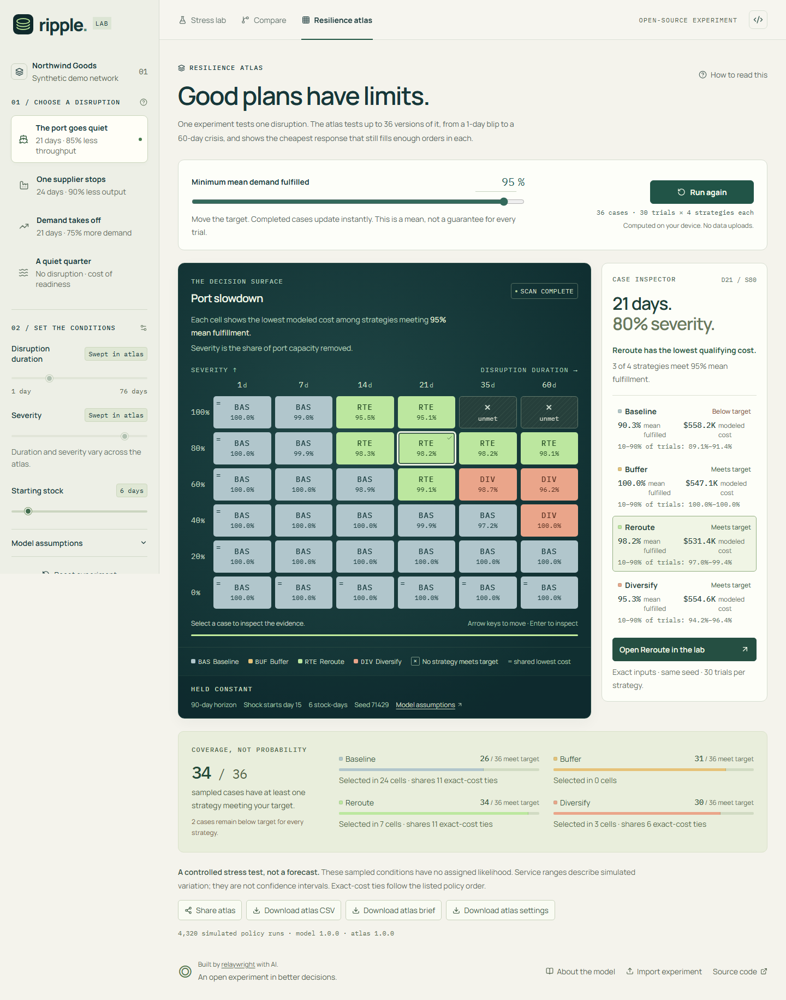

# RIPPLE

### See what a supply-chain disruption costs, and which response pays off.

RIPPLE is a free, browser-based "what if" simulator for a small supply chain. You break something (a port slows down, a supplier stops, or demand spikes), and RIPPLE plays out the next 90 days for four different responses. It then shows how many customer orders each response fills and what each one costs.

**[Open RIPPLE in your browser](https://relaywright.github.io/ripple/)** · [Watch the 22-second walkthrough](artifacts/ripple-walkthrough.mp4) · [Read the user guide](docs/GUIDE.md)


No account, no sign-up, no API key. Everything runs on your own device.

## The question it answers

> "If this part of my supply chain breaks for N days, which response keeps customers served at the lowest cost? And at what point does that answer change?"

Supply-chain trade-offs are hard to explain with a spreadsheet. Extra safety stock costs money every day, even when nothing goes wrong. Rerouting freight is expensive and slow to kick in. A backup supplier charges more per unit. RIPPLE makes those trade-offs visible: you watch stock drain away, see when shelves go empty, and compare the bill for each choice side by side.

## Who it's for

- **Operations, e-commerce, and planning people** who want to build intuition about safety stock, lead times, and backup suppliers, or explain them to a colleague or a boss.
- **Teachers and students** looking for a hands-on example of supply-chain risk, inventory, and simulation.
- **Developers and analysts** who want a small, readable example of a reproducible simulation running in the browser.

RIPPLE is a teaching and exploration tool. Its supply chain is invented, so its numbers are not a forecast for any real business. See [What RIPPLE is not](#what-ripple-is-not).

## The pretend company

Every experiment uses the same small, made-up company ("Northwind Goods"). It sells one product from one warehouse:

| Supplier                  | Share of orders | Route to the Chicago warehouse   | Typical travel time | Price vs. Shenzhen | Freight per unit |
| ------------------------- | --------------: | -------------------------------- | ------------------: | -----------------: | ---------------: |
| Shenzhen, China           |             65% | Ship to Los Angeles, then inland |             22 days |               Base |            $2.40 |
| Ho Chi Minh City, Vietnam |             25% | Ship to Los Angeles, then inland |             25 days |            5% more |            $2.70 |
| Monterrey, Mexico         |             10% | Truck through Houston            |              7 days |           22% more |            $3.60 |

Customers order about 120 units a day (this varies randomly). If the warehouse runs out, that day's unfilled orders are lost sales.

## The four responses

| Response             | What it does                                                                               | The catch                                                                    |
| -------------------- | ------------------------------------------------------------------------------------------ | ---------------------------------------------------------------------------- |
| **Stay the course**  | Change nothing. This is the baseline the other three are measured against.                 | Nothing protects you when the disruption hits.                               |
| **Build a buffer**   | Buy 10 extra days of stock before anything happens.                                        | You pay for that stock, and for storing it, even if nothing breaks.          |
| **Change the route** | 3 days into a port slowdown, send ocean freight to Newark instead of Los Angeles.          | Adds 6 travel days and extra freight. Only helps with port problems.         |
| **Diversify supply** | 5 days into any disruption, shift new orders toward Mexico (45% of orders instead of 10%). | Mexico's higher prices apply to those orders for the rest of the experiment. |

No response wins every time. Which one is cheapest depends on how long and how severe the disruption is, which is exactly what RIPPLE helps you find out.

## How to use it

RIPPLE has three views, along the top of the screen.

### 1. Stress lab: run one experiment

1. **Pick a disruption** in the left panel (on a phone, tap **Scenario & controls**). The default is "The port goes quiet": Los Angeles loses 85% of its capacity for 21 days.
2. **Adjust the conditions** with the sliders: how long it lasts, how severe it is, and how many days of stock you start with.
3. **Watch it play out.** Press play under the map, or drag the **Simulation day** slider. The chart shows warehouse stock falling during the disruption (the shaded area) and recovering after.
4. **Switch responses** with the four cards under the map. The numbers at the top update to show that response's results.

### 2. Compare: see all four side by side

The **Compare** view puts all four responses in one table: share of orders filled, lost sales, total cost, and how each one compares to doing nothing. A bar chart breaks each total into what you paid for: buying stock, shipping it, storing it, and sales you lost.

### 3. Resilience atlas: find where each plan stops working

One experiment tests one version of a disruption. The atlas tests up to 36 versions at once, from a 1-day blip to a 60-day crisis, and from mild to total. You set a **service target** (for example, "fill at least 95% of orders"). Each square in the grid then shows the cheapest response that still meets it, or a cross if none do.



Click any square to see all four responses for that exact case, then open it in the stress lab to replay it day by day. The [user guide](docs/GUIDE.md) walks through every screen and number in more detail.

## Reading the numbers

| Term                   | Plain meaning                                                                                                                       |
| ---------------------- | ----------------------------------------------------------------------------------------------------------------------------------- |
| **Demand fulfilled**   | The share of customer orders the warehouse actually filled. Also called service level.                                              |
| **Lost sales revenue** | Orders you couldn't fill, multiplied by the selling price.                                                                          |
| **Total modeled cost** | What you spent buying, shipping, and storing stock, plus the margin you missed on lost sales (selling price minus unit cost).       |
| **Median recovery**    | The day the warehouse is back to filling nearly every order for a full week after the disruption ends.                              |
| **Trials**             | RIPPLE runs each experiment many times (120 by default) with slightly different demand and travel times, then averages the results. |
| **Seed**               | A number that fixes the random variation, so the same settings always give the same results.                                        |
| **Shaded band**        | The range covering the middle 80% of those trials on each day. The line inside it is the median (middle value).                     |

Every response faces the exact same random demand and travel delays in each trial, so differences between them come from the decision, not from luck.

## Customize it

There are three levels, from easiest to most involved.

**In the app.** Choose a disruption, then drag the sliders for duration, severity, and starting stock. Open **Model assumptions** in the left panel to change daily demand, how much demand varies, the random seed, and how many trials to run.

**With a scenario file.** Some settings (selling price, unit cost, storage cost, when the disruption starts, and how many days to simulate) aren't on screen. To change them:

1. Select **Export results**, then **Reproducible scenario**. This downloads `ripple-scenario.json`.
2. Open it in any text editor and change the values. Here is the default scenario:

   ```json
   {
     "version": 1,
     "name": "The port goes quiet",
     "disruption": "port",
     "startDay": 14,
     "duration": 21,
     "severity": 0.85,
     "horizon": 90,
     "dailyDemand": 120,
     "demandVolatility": 0.15,
     "initialStockDays": 6,
     "unitRevenue": 85,
     "unitCost": 32,
     "holdingCost": 0.03,
     "seed": 71429,
     "trials": 120
   }
   ```

3. Select **Import experiment** at the bottom of the page and choose your edited file.

The [user guide](docs/GUIDE.md#change-any-setting-with-a-scenario-file) explains every field and its allowed range. RIPPLE rejects a file with a clear message if a value is out of range.

**In the code.** To change the network itself (suppliers, routes, travel times, prices), the responses, or the preset scenarios, see the [customization guide](docs/CUSTOMIZING.md). It points to the exact files and the tests to run afterward.

## Share and export

- **Share scenario** copies a link that contains every setting. Anyone who opens it sees the same results.
- **Export results** downloads a one-page decision brief (HTML, printable to PDF), a spreadsheet of results (CSV), or the scenario file.
- The atlas has its own **Share atlas** link and downloads.

Share links and scenario files carry settings only; the brief and spreadsheet also include the results. Everything is created in your browser, and nothing is uploaded or stored on a server.

## What RIPPLE is not

- **Not a forecast.** The company, routes, prices, and travel times are invented for teaching. They are not real logistics data.
- **Not live tracking.** The moving dots on the map illustrate flow. They are not real shipments.
- **Not a full planning system.** It models one product, one warehouse, and one disruption at a time. Missed orders are lost, not filled later.
- **Not purchasing advice.** "Lowest modeled cost" means lowest under these made-up assumptions. Use real data and expert review for real decisions.

The [model reference](docs/MODEL.md) lists every assumption and equation.

## Run it on your own computer

Install [Node.js](https://nodejs.org/) 22.12 or newer. Then run these commands from the project folder (they work in PowerShell, macOS Terminal, and Linux shells):

```sh
npm ci
npm run dev
```

Open the local address printed in your terminal (usually `http://127.0.0.1:5173`). There is no database, backend, environment file, or paid service to set up.

To check a change before releasing it:

```sh
npm run check
npm run build
npx playwright install chromium firefox
npm run test:e2e
```

`check` runs the TypeScript compiler and the simulation tests. `test:e2e` runs browser tests against the production build. To host it yourself, run `npm run build` and upload the `dist/` folder to any static web host (it has to be served over HTTP; opening `index.html` straight from disk won't work).

## Documentation

| Document                                    | Read it if you want to...                                                 |
| ------------------------------------------- | ------------------------------------------------------------------------- |
| [User guide](docs/GUIDE.md)                 | Learn every screen, number, and setting, with worked examples and an FAQ. |
| [Customization guide](docs/CUSTOMIZING.md)  | Change the network, responses, presets, or costs in the code.             |
| [Resilience atlas reference](docs/ATLAS.md) | Understand exactly how the atlas grid, target, and coverage work.         |
| [Model reference](docs/MODEL.md)            | See every equation, assumption, and input limit.                          |
| [Architecture](docs/ARCHITECTURE.md)        | Understand how the code is organized and why.                             |
| [Design system](docs/design-system.md)      | Follow the visual and accessibility rules.                                |
| [Demo script](docs/SHOWCASE.md)             | Present RIPPLE to someone in two minutes.                                 |
| [Release evidence](docs/RELEASE.md)         | See what was checked for each release.                                    |

## For technical reviewers

| Claim                                       | Where to look                                                                                                       |
| ------------------------------------------- | ------------------------------------------------------------------------------------------------------------------- |
| Results are reproducible                    | Each scenario stores its random seed and each result stores its model version. The simulation has no React code.    |
| Responses are compared fairly               | Common random numbers give every response the same demand and travel draws in each trial.                           |
| Uncertainty is visible                      | Many trials produce percentile bands and service ranges. These describe the model's variation, not real-world odds. |
| Heavy computation stays off the main thread | The simulation and atlas run in Web Workers.                                                                        |
| Inputs are validated                        | Imported files and shared links are checked strictly before they reach the simulation.                              |
| No hidden services                          | Static build with local fonts and map data. No accounts, analytics, or external APIs at runtime.                    |
| Changes are checked                         | CI runs type checks, simulation tests, the production build, and browser tests.                                     |

## Built with AI, with the work visible

relaywright started RIPPLE to turn an e-commerce operations background into a useful, inspectable product, and set its goal and quality bar: a polished working experience, meaningful business trade-offs, and source code other people can evaluate.

AI agents wrote the implementation, tests, and documentation. The simulation source, written assumptions, reproducible experiments, and release checks make that work reviewable. RIPPLE does not claim production customers or measured business savings.

## Contribute

Read [CONTRIBUTING.md](CONTRIBUTING.md) before changing the model or adding a dependency. Report security concerns using [SECURITY.md](SECURITY.md).

Released under the [MIT license](LICENSE). Third-party assets and dependencies keep their own licenses; see [THIRD_PARTY_NOTICES.md](THIRD_PARTY_NOTICES.md).
