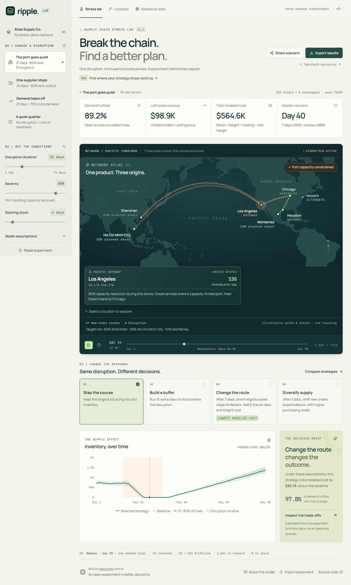

# RIPPLE

### Break the chain. Find a better plan.

A supply-chain stress lab that makes the cost of a disruption visible. Close a port, lose a supplier, or spike demand. Compare four responses against the same simulated conditions, then replay the consequences day by day.

**[Launch the live lab](https://relaywright.github.io/ripple/)** · [Watch the product walkthrough](artifacts/ripple-walkthrough.mp4) · [Read the model](docs/MODEL.md)



**No account. No API key. Computation stays in your browser.**

RIPPLE is a synthetic, single-product educational simulation. Its numbers are model outputs, not live logistics data or operational forecasts. The map shows the modeled network; moving marks illustrate flow, not measured shipment locations.

## Try an experiment

1. Choose **The port goes quiet** and increase its disruption duration.
2. Select **Compare strategies** to compare keeping the current plan, carrying more stock, rerouting freight, and shifting sourcing toward Mexico.
3. Inspect the tradeoff between fulfilled demand and cost. A more resilient plan is not automatically the cheapest.
4. Move **Simulation day** to replay inventory and the network. The uncertainty band summarizes many trials; replay follows one seeded trial.
5. Use **Share scenario** to reproduce the inputs, or **Export results** to keep an inspectable record.

See the [two-minute walkthrough](docs/SHOWCASE.md) for a guided demo.

## Run locally

Install [Node.js](https://nodejs.org/) 22.12 or newer, then run these commands from the project folder. They work in PowerShell, macOS, and Linux shells.

```sh
npm ci
npm run dev
```

Open the local address printed in your terminal. There is no environment file, database, backend, or paid service to configure. Installing dependencies requires internet access; the application itself uses bundled assets and local computation.

## What a technical reviewer can inspect

| Claim                                           | Evidence to inspect                                                                                                                            |
| ----------------------------------------------- | ---------------------------------------------------------------------------------------------------------------------------------------------- |
| Results are reproducible                        | The scenario records its random seed and the result records its model version; the simulation is independent of React.                         |
| Policy comparisons use matched conditions       | Common random numbers give strategies the same trial demand and shared route conditions.                                                       |
| Uncertainty is visible                          | Monte Carlo trials produce inventory percentile bands and service-level ranges. These are simulated ranges, not calibrated forecast intervals. |
| Computation is separated from presentation      | The simulation runs in a Web Worker so React handles controls and drawing.                                                                     |
| Inputs cross a validation boundary              | JSON imports and shared URLs are checked before they become simulation inputs.                                                                 |
| The product can be reviewed without credentials | Static build, local fonts and map data, no accounts, analytics, or runtime external APIs.                                                      |
| Changes have a release check                    | Type checking, simulation tests, production build, and browser tests run in CI.                                                                |

The [architecture notes](docs/ARCHITECTURE.md) explain the software boundaries and tradeoffs. The [model reference](docs/MODEL.md) records the equations, cost ledger, and numerical assumptions. The [design system](docs/design-system.md) records the visual and accessibility rules.

## Verify a release

```sh
npm run check
npm run build
npx playwright install chromium
npm run test:e2e
```

`check` runs TypeScript and the simulation tests. Browser tests exercise the production build. On a Linux CI runner, use `npx playwright install --with-deps chromium` to install the browser's system dependencies as well. See [Playwright's CI instructions](https://playwright.dev/docs/ci).

To inspect the production build manually:

```sh
npm run preview
```

The generated `dist/` folder can be served by a static web host. Vite uses relative asset paths, so the same build can live at a domain root or a project subdirectory. Serve it over HTTP(S); opening `index.html` directly from disk does not support the worker correctly.

## Model boundaries

- One product, a fixed network, daily time steps, and synthetic parameters.
- Lost demand is not backlogged. Supplier behavior and transport times are deliberately simplified.
- The model does not include real shipment feeds, live weather, customs, supplier contracts, or a multi-product capacity planning system.
- Policy rankings depend on the chosen scenario and the model's cost assumptions. They are not purchasing recommendations.
- Percentile bands describe variability within this model. They do not establish how likely a real-world outcome is.
- There is no service worker or guarantee of a fresh offline page load. Once the app and its local assets load, experiments do not need an external service.

## Built with AI, with the work visible

relaywright initiated RIPPLE to turn an e-commerce operations perspective into a useful, inspectable product, and set the portfolio goal and quality bar: a beautiful working experience, meaningful business decisions, and source code that other people can evaluate.

AI agents developed the implementation, tests, and documentation. This repository makes that work reviewable through the simulation source, explicit assumptions, reproducible experiments, and release checks. It does not claim independent software engineering experience, production customer adoption, or measured business savings.

## Contribute

Read [CONTRIBUTING.md](CONTRIBUTING.md) before changing the model or adding a dependency. Report security concerns using [SECURITY.md](SECURITY.md).

Released under the [MIT license](LICENSE). Third-party assets and dependencies retain their own licenses; see [THIRD_PARTY_NOTICES.md](THIRD_PARTY_NOTICES.md).
