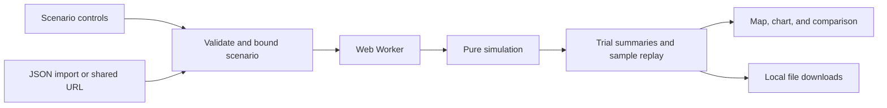

# Architecture and model notes

RIPPLE is a static application with one deliberate boundary: the interface can ask for an experiment, but the simulation does not know that React or a browser exists.

## Code map

| Location                   | Responsibility                                                                                             |
| -------------------------- | ---------------------------------------------------------------------------------------------------------- |
| `src/simulation/`          | Types, model parameters, scenario validation, seeded simulation, and numerical tests. No React dependency. |
| `src/simulation.worker.ts` | Validate worker messages, run experiments, and return either a result or a readable error.                 |
| `src/App.tsx`              | Scenario controls, experiment lifecycle, policy selection, replay, dialogs, and persistence.               |
| `src/components/`          | Network and inventory visualizations.                                                                      |
| `src/lib/scenario.ts`      | Bounded JSON parsing, URL encoding and decoding, and local downloads.                                      |
| `src/lib/export.ts`        | CSV results and a standalone HTML decision brief.                                                          |
| `src/data/`                | Synthetic network definitions and bundled geographic data.                                                 |
| `tests/e2e/`               | Browser checks against the production build.                                                               |

## Reproducibility

A scenario is a versioned value: disruption, duration, severity, demand assumptions, costs, horizon, trial count, and random seed. An experiment also reports a model version. Reproducing inputs is necessary but not sufficient for exact historical output; the simulation code and model version must match as well.

The model runs multiple trials to expose demand and lead-time variability. For a given trial, policy comparisons share random conditions. This technique, commonly called **common random numbers**, reduces avoidable noise in comparisons. It does not remove modeling uncertainty or prove that a scenario resembles a real business.

For each policy, the output contains a mean summary, percentile bands, and a single trial's daily snapshots. The replay follows those snapshots; the inventory chart's median and band aggregate trials. A median curve need not describe any one trial that actually occurred.

The simulation should remain deterministic: no `Math.random()`, current time, network response, React state, or animation timing may affect its output. Changing only the number of trials should preserve the underlying random stream for the earlier trials.

## The model in concrete terms

The [model reference](MODEL.md) is the detailed source for parameter bounds, daily event order, and equations.

Each trial advances one day at a time. It places planned orders, clears eligible freight through a gateway, receives stock, fulfills the day's demand, records lost sales, and charges holding cost on remaining stock. Goods already in transit at the beginning are included, so the network does not start with an empty pipeline. A conservation audit accounts for initial stock, the initial pipeline, new procurement, fulfilled units, and closing stock and freight.

| Source   | Normal sourcing share | Base warehouse lead time | Purchase multiplier | Freight per unit |
| -------- | --------------------- | ------------------------ | ------------------- | ---------------- |
| Shenzhen | 65%                   | 22 days                  | 1.00                | $2.40            |
| Vietnam  | 25%                   | 25 days                  | 1.05                | $2.70            |
| Mexico   | 10%                   | 7 days                   | 1.22                | $3.60            |

These are authored teaching assumptions, not empirical estimates. Ocean lead times vary by up to two days; Mexico's lead varies by up to one day. Daily demand uses a seeded normal draw, rounded to units and bounded below. Facilities share pooled warehouse inventory. Gateway throughput is limited; the Los Angeles queue clears in arrival order.

The buffer policy starts with ten extra days of inventory and pays for it. Rerouting reacts to a port event after three days, diverts eligible ocean freight to Newark, and adds six transit days and $4.80 freight per unit. Diversification reacts after five days, shifts the order mix toward Mexico, and changes the modeled available capacity. All policies observe a demand surge with the same three-day planning delay.

Total cost is procurement plus transport plus holding cost plus lost contribution margin. Procurement and transport include the initial inventory and initial pipeline. Lost margin uses lost units multiplied by the base unit revenue minus base unit cost. It does not account for each lost unit's hypothetical supplier premium or avoided freight. Lost revenue is reported separately and is not counted again in total cost. No closing inventory salvage credit is applied. `bestPolicy` is the policy with the lowest mean total cost under these assumptions; it is not a multi-objective optimizer.

Recovery is the first day after the disruption followed by a seven-day window with at least 95% daily fulfillment and at least 98% fulfillment across that window. The summary takes the upper median recovery day with unrecovered trials treated as infinity. If that median is unrecovered, recovery is `null`. No-disruption and zero-severity scenarios also report `null`; the interface must distinguish that case from failure to recover.

## Input boundary

Scenario files are limited to 16 KB before JSON parsing. Shared-link payloads are length-limited before decoding and are validated through the same parser. The worker validates incoming messages again before doing computation.

Validation is responsible for rejecting malformed values, non-finite numbers, unsupported versions and enums, and parameters outside the model's supported ranges. It must construct a known scenario shape rather than pass arbitrary imported fields through to the model. Limits on horizon and trial count also bound computational work.

The validator rejects unknown and missing fields, requires scenario version 1, and bounds the horizon to 30–180 days and the trial count to 1–500. Model days are zero-based; the interface adds one to display Day 1 through the horizon. The disruption must fit within the horizon. Severity is between 0 and 1. The seed is an unsigned 32-bit integer. Cost, demand, volatility, and stock parameters are finite and bounded in the validator; unit cost may not exceed unit revenue. Names contain 1–100 printable characters.

Scenario names are displayed as text. The HTML report escapes user-controlled text and has a restrictive content security policy. It contains no executable script. CSV output uses fixed policy IDs and numeric values, rather than copying arbitrary imported names into cells.

## Computation and presentation

Each comparison runs outside the main browser thread in a Web Worker. The UI remains available for inspection and controls while the worker computes. The application must discard or terminate an obsolete computation when a newer experiment supersedes it, and it must keep a result paired with the scenario that produced it.

The network map uses local geographic data and synthetic facilities. The visual route layout is an explanatory drawing, not a transport routing engine. Animated flow is decorative. Its position must never be described as the measured location of a shipment.

Controls use native buttons, inputs, and dialogs where possible. A slider provides a keyboard alternative to clicking the chart. Reduced-motion preferences must suppress automatic decorative motion. The narrow layout retains the experiment, explanations, import/export, and replay controls.

## Downloads and privacy

Scenario JSON records the experiment inputs. CSV provides the numerical comparison. The standalone HTML brief records assumptions and includes the scenario JSON for reproduction. Downloads are generated from browser memory using object URLs, then those URLs are revoked.

Shared scenarios are encoded, not encrypted. Anyone with the URL can read them. Local persistence is a convenience, not an account or a backup service. Do not enter confidential data.

The production app has no runtime dependency on an external API, analytics service, or hosted font endpoint. The JavaScript, fonts, map, and worker are served with the static app. That removes credentials and external service availability from the demo path. It does not provide offline installation: there is no service worker.

## Tests and their limits

Numerical tests should establish reproducibility and invariants such as nonnegative inventory, fulfilled demand not exceeding demand, valid percentile ordering, and correct cost accounting. They should also test rejected input, boundaries, and specific mechanisms rather than only snapshot a large output.

Browser tests check the integrated experience: scenario selection, worker results, replay, imports, exports, share links, dialogs, and narrow layouts. Automated accessibility scans supplement keyboard checks; they do not certify accessibility. Chromium coverage does not establish compatibility with every browser.

CI executes type checks, unit tests, the production build, and browser checks. Passing these checks is evidence about the implementation under tested conditions. It does not validate the model against real operational data.

## Deliberate limits

The model covers a single product and pooled inventory in daily time steps. Unfulfilled demand becomes lost sales. Suppliers, route delays, response policies, and costs are synthetic. It excludes multi-product dependencies, real capacity plans, contracts, customs, fixed overhead, and closing inventory liquidation value.

Cost-based rankings depend on those assumptions and the selected horizon. A policy can preserve service while increasing modeled cost. The product should make that tradeoff visible rather than hide it inside an unexplained score.

Changing these limits would require model redesign and new tests, not just another control on the screen.
